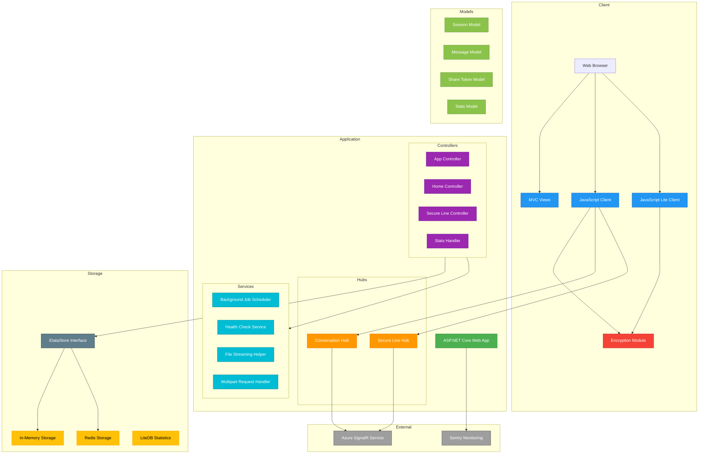

```mermaid
graph TB
    subgraph Client
        Browser["Web Browser"]
        Views["MVC Views"]:::frontend
        JSClient["JavaScript Client"]:::frontend
        JSLite["JavaScript Lite Client"]:::frontend
        Encrypt["Encryption Module"]:::security
        
        Browser --> Views
        Browser --> JSClient
        Browser --> JSLite
        JSClient --> Encrypt
        JSLite --> Encrypt
    end

    subgraph Application
        WebApp["ASP.NET Core Web App"]:::backend
        
        subgraph Controllers
            AppCtrl["App Controller"]:::controller
            HomeCtrl["Home Controller"]:::controller
            SecureCtrl["Secure Line Controller"]:::controller
            StatsCtrl["Stats Handler"]:::controller
        end
        
        subgraph Hubs
            ConvHub["Conversation Hub"]:::realtime
            SecureHub["Secure Line Hub"]:::realtime
        end
        
        subgraph Services
            BGJob["Background Job Scheduler"]:::service
            Health["Health Check Service"]:::service
            FileStream["File Streaming Helper"]:::service
            MultiPart["Multipart Request Handler"]:::service
        end
    end

    subgraph Storage
        IStore["IDataStore Interface"]:::interface
        InMem["In-Memory Storage"]:::storage
        Redis["Redis Storage"]:::storage
        LiteDB["LiteDB Statistics"]:::storage
        
        IStore --> InMem
        IStore --> Redis
    end

    subgraph Models
        Session["Session Model"]:::model
        Message["Message Model"]:::model
        ShareToken["Share Token Model"]:::model
        Stats["Stats Model"]:::model
    end

    subgraph External
        AzureSignalR["Azure SignalR Service"]:::external
        Sentry["Sentry Monitoring"]:::external
    end

    JSClient --> ConvHub
    JSClient --> SecureHub
    ConvHub --> AzureSignalR
    SecureHub --> AzureSignalR
    
    WebApp --> Sentry
    Controllers --> IStore
    Controllers --> Services
    
    %% Component Mappings
    click Views "https://github.com/mustakimali/just-an-email/tree/master/src/JustSending/Views/"
    click JSClient "https://github.com/mustakimali/just-an-email/blob/master/src/JustSending/wwwroot/js/JustSendingApp.js"
    click JSLite "https://github.com/mustakimali/just-an-email/blob/master/src/JustSending/wwwroot/js/JustSendingApp.Lite.js"
    click Encrypt "https://github.com/mustakimali/just-an-email/blob/master/src/JustSending/wwwroot/js/JustEncrypt.js"
    click AppCtrl "https://github.com/mustakimali/just-an-email/blob/master/src/JustSending/Controllers/AppController.cs"
    click HomeCtrl "https://github.com/mustakimali/just-an-email/blob/master/src/JustSending/Controllers/HomeController.cs"
    click SecureCtrl "https://github.com/mustakimali/just-an-email/blob/master/src/JustSending/Controllers/SecureLineController.cs"
    click ConvHub "https://github.com/mustakimali/just-an-email/blob/master/src/JustSending/Services/ConversationHub.cs"
    click SecureHub "https://github.com/mustakimali/just-an-email/blob/master/src/JustSending/Services/SecureLineHub.cs"
    click InMem "https://github.com/mustakimali/just-an-email/blob/master/src/JustSending/Data/DataStoreInMemory.cs"
    click Redis "https://github.com/mustakimali/just-an-email/blob/master/src/JustSending/Data/DataStoreRedis.cs"
    click IStore "https://github.com/mustakimali/just-an-email/blob/master/src/JustSending/Data/IDataStore.cs"
    click Session "https://github.com/mustakimali/just-an-email/blob/master/src/JustSending/Data/Models/Session.cs"
    click Message "https://github.com/mustakimali/just-an-email/blob/master/src/JustSending/Data/Models/Message.cs"
    click ShareToken "https://github.com/mustakimali/just-an-email/blob/master/src/JustSending/Data/Models/ShareToken.cs"
    click BGJob "https://github.com/mustakimali/just-an-email/blob/master/src/JustSending/Services/BackgroundJobScheduler.cs"
    click Health "https://github.com/mustakimali/just-an-email/blob/master/src/JustSending/Services/DefaultHealthCheck.cs"
    click FileStream "https://github.com/mustakimali/just-an-email/blob/master/src/JustSending/Services/FileStreamingHelper.cs"
    click MultiPart "https://github.com/mustakimali/just-an-email/blob/master/src/JustSending/Services/MultipartRequestHelper.cs"
    click Stats "https://github.com/mustakimali/just-an-email/blob/master/src/JustSending/Data/Models/Bson/Stats.cs"
    click StatsCtrl "https://github.com/mustakimali/just-an-email/blob/master/src/JustSending/Controllers/StatsRawHandler.cs"

    %% Styling
    classDef frontend fill:#2196F3,stroke:#1565C0,color:white
    classDef backend fill:#4CAF50,stroke:#2E7D32,color:white
    classDef security fill:#F44336,stroke:#C62828,color:white
    classDef storage fill:#FFC107,stroke:#FFA000,color:black
    classDef controller fill:#9C27B0,stroke:#6A1B9A,color:white
    classDef service fill:#00BCD4,stroke:#00838F,color:white
    classDef realtime fill:#FF9800,stroke:#EF6C00,color:white
    classDef model fill:#8BC34A,stroke:#558B2F,color:white
    classDef interface fill:#607D8B,stroke:#37474F,color:white
    classDef external fill:#9E9E9E,stroke:#424242,color:white
```
